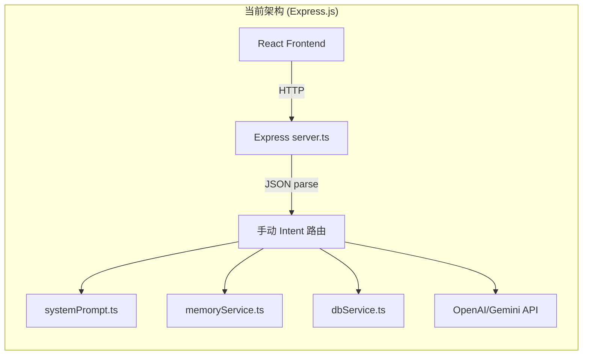
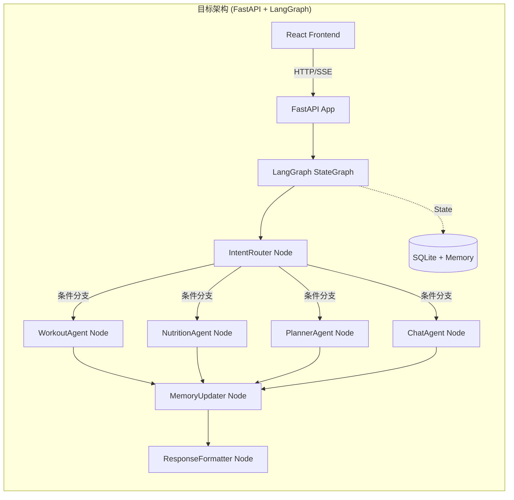

# Sparky AI Fitness Agent → FastAPI + LangGraph 升级方案

## 目标概述

将 Sparky AI Fitness Agent 的后端从 **Express.js (TypeScript)** 迁移到 **FastAPI (Python) + LangGraph** 架构，实现：

1. **Agent 编排升级**：从手动 Intent 路由（JSON解析 + switch-case）迁移到 LangGraph 状态图编排
2. **后端框架升级**：从 Express.js 迁移到 FastAPI（async-native、Pydantic 校验、自动文档）
3. **前端保持不变**：React 19 前端通过 API 调用与新后端通信，UI 层零改动

---

## 当前架构 vs 目标架构





---

## User Review Required

> [!IMPORTANT]
> **语言栈切换**：后端从 TypeScript 迁移到 Python。这意味着所有后端服务（dbService、memoryService、trainingAnalytics 等）都需要用 Python 重写。这是一个 **非增量** 的大变更。

> [!WARNING]
> **前端开发服务器**：当前 Vite 通过 Express 的 `middlewareMode` 集成。迁移后前端和后端将分离运行（Vite dev server + FastAPI server），前端通过代理转发 API 请求。

> [!IMPORTANT]
> **数据库兼容性**：现有 `fitness.sqlite` 数据库文件和 schema 将被保留。Python 端使用 `aiosqlite` 连接同一个数据库文件，确保数据零丢失。

> [!CAUTION]
> **LLM API 调用方式变化**：当前使用原始 fetch 调用 OpenAI API 并手动解析 JSON。迁移后将使用 `langchain-openai` / `langchain-google-genai` 作为 LLM 提供商，配合 LangGraph 的结构化输出（`with_structured_output`）来替代手动 JSON 解析。

---

## Proposed Changes

### 项目结构重组

当前 TypeScript 后端代码将被替换为 Python 后端，项目结构变为前后端分离的 monorepo：

```
sparky-ai-fitness-agent/
├── backend/                          # [NEW] Python FastAPI 后端
│   ├── pyproject.toml                # Python 项目配置 (uv/pip)
│   ├── .env                          # 环境变量
│   ├── app/
│   │   ├── __init__.py
│   │   ├── main.py                   # FastAPI 应用入口
│   │   ├── config.py                 # Pydantic Settings 配置
│   │   ├── models/                   # Pydantic 数据模型
│   │   │   ├── __init__.py
│   │   │   ├── chat.py               # 聊天请求/响应模型
│   │   │   ├── records.py            # 健身记录模型
│   │   │   └── memory.py             # 记忆系统模型
│   │   ├── api/                      # API 路由层
│   │   │   ├── __init__.py
│   │   │   ├── chat.py               # /api/chat-openai 等
│   │   │   ├── sessions.py           # /api/chat-sessions 等
│   │   │   ├── records.py            # /api/save-record, /api/logs 等
│   │   │   ├── analysis.py           # /api/analysis/* 等
│   │   │   ├── memory.py             # /api/semantic-memory 等
│   │   │   └── uploads.py            # /api/upload-image
│   │   ├── agent/                    # LangGraph Agent 核心
│   │   │   ├── __init__.py
│   │   │   ├── state.py              # AgentState TypedDict 定义
│   │   │   ├── graph.py              # StateGraph 构建与编译
│   │   │   ├── nodes/
│   │   │   │   ├── __init__.py
│   │   │   │   ├── intent_router.py  # 意图路由节点
│   │   │   │   ├── workout_agent.py  # 训练记录/计划 Agent
│   │   │   │   ├── nutrition_agent.py # 饮食记录/分析 Agent
│   │   │   │   ├── chat_agent.py     # 普通对话 Agent
│   │   │   │   ├── memory_updater.py # 记忆更新节点
│   │   │   │   └── response_formatter.py # 响应格式化节点
│   │   │   └── prompts/
│   │   │       ├── __init__.py
│   │   │       ├── system.py         # 系统提示词
│   │   │       ├── intent.py         # 意图识别提示词
│   │   │       └── domain.py         # 领域专用提示词
│   │   ├── services/                 # 业务逻辑层
│   │   │   ├── __init__.py
│   │   │   ├── db.py                 # SQLite 数据库操作
│   │   │   ├── memory.py             # 三层记忆系统
│   │   │   ├── training_analytics.py # 训练分析
│   │   │   ├── nutrition_service.py  # 营养分析
│   │   │   └── insight_engine.py     # 洞察引擎
│   │   └── utils/
│   │       ├── __init__.py
│   │       └── image.py              # 图片处理工具
│   └── tests/                        # 测试
│       ├── test_agent.py
│       ├── test_api.py
│       └── test_services.py
├── src/                              # [保留] React 前端（不修改）
│   ├── App.tsx
│   ├── components/
│   └── ...
├── fitness.sqlite                    # [保留] 数据库文件
├── package.json                      # [MODIFY] 添加代理配置
├── vite.config.ts                    # [MODIFY] 添加 API 代理
└── ...
```

---

### Component 1: LangGraph Agent 核心 (`backend/app/agent/`)

这是本次升级的**核心组件**，将当前的"AI返回JSON → 服务端解析 → switch-case路由"模式替换为 LangGraph 状态图编排。

#### [NEW] [state.py](file:///f:/cch/code/sparky-ai-fitness-agent/backend/app/agent/state.py) — Agent 状态定义

```python
from typing import TypedDict, Annotated, Optional, Any
from operator import add

class AgentState(TypedDict):
    # 输入层
    user_message: str
    session_id: str
    base64_image: Optional[str]
    image_key: Optional[str]
    chat_history: list[dict]

    # 记忆层（由 ContextBuilder 注入）
    semantic_memory: dict       # 用户画像
    episodic_memory: list       # 近期活动
    working_memory: dict        # 当前会话

    # 处理层
    detected_intent: str        # 识别出的意图
    intent_confidence: float    # 意图置信度
    structured_data: dict       # 提取的结构化数据（训练/饮食等）
    profile_update: Optional[dict]  # 用户画像增量更新
    entry_date: Optional[str]   # 日志日期

    # 输出层
    ai_response: str            # AI 回复文本
    response_payload: dict      # 最终返回给前端的完整 payload
```

#### [NEW] [graph.py](file:///f:/cch/code/sparky-ai-fitness-agent/backend/app/agent/graph.py) — LangGraph 工作流编排

核心图结构：

```
Entry → ContextBuilder → IntentRouter ─┬→ WorkoutAgent ──┐
                                        ├→ NutritionAgent ─┤
                                        ├→ PlannerAgent ───┤→ MemoryUpdater → ResponseFormatter → END
                                        ├→ VisionAgent ────┤
                                        └→ ChatAgent ──────┘
```

```python
from langgraph.graph import StateGraph, END
from .state import AgentState

def build_agent_graph():
    workflow = StateGraph(AgentState)

    # 添加节点
    workflow.add_node("context_builder", context_builder_node)
    workflow.add_node("intent_router", intent_router_node)
    workflow.add_node("workout_agent", workout_agent_node)
    workflow.add_node("nutrition_agent", nutrition_agent_node)
    workflow.add_node("planner_agent", planner_agent_node)
    workflow.add_node("vision_agent", vision_agent_node)
    workflow.add_node("chat_agent", chat_agent_node)
    workflow.add_node("memory_updater", memory_updater_node)
    workflow.add_node("response_formatter", response_formatter_node)

    # 入口
    workflow.set_entry_point("context_builder")
    workflow.add_edge("context_builder", "intent_router")

    # 条件分支：根据意图路由到不同 Agent
    workflow.add_conditional_edges(
        "intent_router",
        route_by_intent,
        {
            "workout": "workout_agent",
            "nutrition": "nutrition_agent",
            "planner": "planner_agent",
            "vision": "vision_agent",
            "chat": "chat_agent",
        }
    )

    # 所有 Agent 汇聚到 MemoryUpdater
    for node in ["workout_agent", "nutrition_agent", "planner_agent",
                  "vision_agent", "chat_agent"]:
        workflow.add_edge(node, "memory_updater")

    workflow.add_edge("memory_updater", "response_formatter")
    workflow.add_edge("response_formatter", END)

    return workflow.compile()


def route_by_intent(state: AgentState) -> str:
    """根据 detected_intent 路由到对应 Agent"""
    intent = state["detected_intent"]
    if intent in ("log_strength_workout", "log_exercise"):
        return "workout"
    elif intent in ("log_food", "log_food_multi"):
        if state.get("base64_image"):
            return "vision"
        return "nutrition"
    elif intent in ("generate_workout_plan", "update_workout_plan"):
        return "planner"
    else:
        return "chat"
```

#### [NEW] 各 Agent 节点（`nodes/` 目录）

| 节点 | 对应当前逻辑 | LLM 调用方式 |
|------|-------------|-------------|
| `context_builder` | `buildAgentContext()` + `formatContextAsSystemPrompt()` | 无 LLM 调用，纯数据组装 |
| `intent_router` | 当前由 LLM 在 JSON 中返回 `intent` 字段 | `llm.with_structured_output(IntentResult)` |
| `workout_agent` | `server.ts` 中 `log_strength_workout` 分支 | `llm.with_structured_output(WorkoutLog)` |
| `nutrition_agent` | `server.ts` 中 `log_food` 分支 | `llm.with_structured_output(FoodLog)` |
| `vision_agent` | `server.ts` 中 `log_food_multi` + 图片分支 | 多模态 LLM 调用 + `with_structured_output` |
| `planner_agent` | `server.ts` 中 `generate_workout_plan` 分支 | `llm.with_structured_output(WorkoutPlan)` |
| `chat_agent` | `server.ts` 中 `chat` 分支 | 普通 LLM 调用 |
| `memory_updater` | `updateSemanticMemory()` + `addChatMessage()` | 无 LLM 调用，纯数据写入 |
| `response_formatter` | `res.json({ success: true, ...aiResponse })` | 无 LLM 调用，纯格式化 |

> [!TIP]
> **关键设计决策**：意图识别被分离为独立的 `intent_router` 节点，使用 `with_structured_output` 替代全量 JSON 解析。这使得每个下游 Agent 可以专注于自己的领域，使用独立的、更精准的 prompt。当前架构中单一 system prompt 承担了所有 intent 的结构化输出定义，prompt 过长且容易出错。

---

### Component 2: FastAPI API 层 (`backend/app/api/`)

#### [NEW] [main.py](file:///f:/cch/code/sparky-ai-fitness-agent/backend/app/main.py) — FastAPI 应用入口

```python
from fastapi import FastAPI
from fastapi.middleware.cors import CORSMiddleware
from fastapi.staticfiles import StaticFiles

app = FastAPI(title="Sparky AI Fitness Agent", version="2.0")

app.add_middleware(CORSMiddleware, allow_origins=["*"], ...)
app.mount("/uploads", StaticFiles(directory="uploads"), name="uploads")

# 注册路由
app.include_router(chat_router, prefix="/api")
app.include_router(sessions_router, prefix="/api")
app.include_router(records_router, prefix="/api")
app.include_router(analysis_router, prefix="/api/analysis")
app.include_router(memory_router, prefix="/api")
app.include_router(uploads_router, prefix="/api")
```

#### [NEW] [chat.py](file:///f:/cch/code/sparky-ai-fitness-agent/backend/app/api/chat.py) — 核心聊天路由 (支持 SSE 流式响应)

```python
from fastapi import APIRouter
from fastapi.responses import StreamingResponse
from app.agent.graph import get_agent_graph

@router.post("/chat-openai")
async def chat_openai(request: ChatRequest):
    """核心对话端点 — 调用 LangGraph Agent"""
    graph = get_agent_graph()
    
    initial_state = {
        "user_message": request.messages[-1].content,
        "session_id": request.session_id,
        "base64_image": request.base64_image,
        "image_key": request.image_key,
        "chat_history": [m.model_dump() for m in request.messages],
        # ... 其他字段初始化为默认值
    }
    
    # 采用 SSE (Server-Sent Events) 流式返回响应
    async def event_stream():
        async for event in graph.astream_events(initial_state, version="v2"):
            # 解析 LangGraph 事件，提取 LLM 生成的 token 并通过 SSE 推送给前端
            # 实现 "逐字打出" 的效果
            if event["event"] == "on_chat_model_stream":
                yield f"data: {event['data']['chunk'].content}\n\n"
        
        # 最终返回结构化数据的 payload
        final_state = await graph.ainvoke(initial_state)
        import json
        yield f"event: final_payload\ndata: {json.dumps(final_state['response_payload'])}\n\n"

    return StreamingResponse(event_stream(), media_type="text/event-stream")
```

#### API 端点对照表

| 当前端点 (Express) | 新端点 (FastAPI) | 变化 |
|---|---|---|
| `POST /api/chat-openai` | `POST /api/chat-openai` | 内部改用 LangGraph |
| `POST /api/upload-image` | `POST /api/upload-image` | `python-multipart` 替代 |
| `POST /api/save-record` | `POST /api/save-record` | Pydantic 校验 |
| `GET /api/logs` | `GET /api/logs` | 同上 |
| `GET/POST /api/chat-sessions` | `GET/POST /api/chat-sessions` | 同上 |
| `PATCH/DELETE /api/chat-sessions/:id` | `PATCH/DELETE /api/chat-sessions/{id}` | 路径参数格式 |
| `GET /api/chat/:sessionId` | `GET /api/chat/{session_id}` | 同上 |
| `GET /api/semantic-memory` | `GET /api/semantic-memory` | 同上 |
| `GET /api/analysis/*` | `GET /api/analysis/*` | 同上 |
| `GET /api/dictionary/foods` | `GET /api/dictionary/foods` | 同上 |
| `PATCH/DELETE /api/logs/:recordId` | `PATCH/DELETE /api/logs/{record_id}` | 同上 |

> [!NOTE]
> 所有 API 的 **请求/响应格式保持完全兼容**，前端不需要做任何修改。唯一的差异是路由参数从 Express 的 `:param` 格式变为 FastAPI 的 `{param}` 格式，但这对前端透明。

---

### Component 3: 数据库服务 (`backend/app/services/db.py`)

#### [NEW] [db.py](file:///f:/cch/code/sparky-ai-fitness-agent/backend/app/services/db.py) — 异步 SQLite 服务

- 使用 `aiosqlite` 替代 Node.js 的 `sqlite3`
- **完全保留现有 schema**，不修改任何表结构
- 将 `dbService.ts` 中的所有 CRUD 函数逐一翻译为 Python async 版本
- 关键函数迁移清单：

| TypeScript 函数 | Python 函数 | 说明 |
|---|---|---|
| `saveRecord()` | `save_record()` | 保存活动记录 |
| `getHistory()` | `get_history()` | 获取历史日志 |
| `getSessionMessages()` | `get_session_messages()` | 获取会话消息 |
| `addChatMessage()` | `add_chat_message()` | 添加聊天消息 |
| `saveMealLogMulti()` | `save_meal_log_multi()` | 保存多食物图片记录 |
| `listChatSessions()` | `list_chat_sessions()` | 列出会话 |
| `createChatSession()` | `create_chat_session()` | 创建会话 |
| `updateChatSession()` | `update_chat_session()` | 更新会话 |
| `deleteChatSession()` | `delete_chat_session()` | 删除会话 |
| `updateActivityRecord()` | `update_activity_record()` | 更新活动记录 |
| `deleteActivityRecord()` | `delete_activity_record()` | 删除活动记录 |
| `getSemanticMemory()` | `get_semantic_memory()` | 获取语义记忆 |
| `saveSemanticMemory()` | `save_semantic_memory()` | 保存语义记忆 |
| `getEpisodicMemories()` | `get_episodic_memories()` | 获取情景记忆 |

---

### Component 4: 记忆系统 (`backend/app/services/memory.py`)

#### [NEW] [memory.py](file:///f:/cch/code/sparky-ai-fitness-agent/backend/app/services/memory.py) — 三层记忆系统

直接翻译 `memoryService.ts` 的逻辑，保持三层架构：

| 记忆层 | 内容 | 存储方式 |
|---|---|---|
| **Semantic Memory** | 用户画像（目标、弱点、伤病、偏好） | SQLite `semantic_memory` 表 (JSON) |
| **Episodic Memory** | 最近 10 条活动记录 | SQLite `activity_records` 表查询 |
| **Working Memory** | 当前会话上下文（最近 5 条消息） | 内存中（通过请求传入） |

与当前实现的关键区别：
- Python 的 Pydantic 模型替代 TypeScript interface，提供运行时校验
- 记忆格式化函数输出保持不变（中文 Markdown 格式），确保 prompt 兼容

---

### Component 5: 分析服务 (`backend/app/services/`)

#### [NEW] [training_analytics.py](file:///f:/cch/code/sparky-ai-fitness-agent/backend/app/services/training_analytics.py)

1:1 翻译 `trainingAnalytics.ts`，函数签名保持一致。

#### [NEW] [nutrition_service.py](file:///f:/cch/code/sparky-ai-fitness-agent/backend/app/services/nutrition_service.py)

1:1 翻译 `nutritionService.ts`。

#### [NEW] [insight_engine.py](file:///f:/cch/code/sparky-ai-fitness-agent/backend/app/services/insight_engine.py)

1:1 翻译 `insightEngine.ts`。

---

### Component 6: 前端适配 (`vite.config.ts`)

#### [MODIFY] [vite.config.ts](file:///f:/cch/code/sparky-ai-fitness-agent/vite.config.ts)

添加 API 代理，将前端的 `/api` 请求转发到 FastAPI 后端：

```diff
 export default defineConfig({
   plugins: [react(), tailwindcss()],
+  server: {
+    proxy: {
+      '/api': {
+        target: 'http://localhost:8000',
+        changeOrigin: true,
+      },
+      '/uploads': {
+        target: 'http://localhost:8000',
+        changeOrigin: true,
+      },
+    },
+  },
 });
```

#### [MODIFY] [package.json](file:///f:/cch/code/sparky-ai-fitness-agent/package.json)

```diff
 "scripts": {
-  "dev": "tsx server.ts",
+  "dev": "vite",
+  "dev:backend": "cd backend && uvicorn app.main:app --reload --port 8000",
+  "dev:all": "concurrently \"npm run dev\" \"npm run dev:backend\"",
   "build": "vite build",
 },
```

---

### Component 7: 依赖管理

#### [NEW] [pyproject.toml](file:///f:/cch/code/sparky-ai-fitness-agent/backend/pyproject.toml)

```toml
[project]
name = "sparky-ai-backend"
version = "2.0.0"
requires-python = ">=3.11"
dependencies = [
    "fastapi>=0.115",
    "uvicorn[standard]>=0.34",
    "python-multipart>=0.0.18",
    "aiosqlite>=0.21",
    "pydantic>=2.10",
    "pydantic-settings>=2.7",
    "langgraph>=0.3",
    "langchain-openai>=0.3",
    "langchain-google-genai>=2.1",
    "langchain-core>=0.3",
    "python-dotenv>=1.0",
    "httpx>=0.28",
]
```

---

## Design Decisions (根据用户反馈确认)

基于用户的选择和提供的 `ai-coach-python` 参考项目，确认以下架构决策：

1. **Python 环境管理器**：使用 **`uv`** 作为 Python 包和环境管理器，提升安装和运行速度。
2. **LLM Provider 策略**：**保留双 Provider 支持**（OpenAI & Gemini），并通过环境变量（或工厂模式）支持在不同的 Agent 节点中根据任务灵活选择模型（例如意图识别使用速度快的 Gemini，复杂营养分析或计划生成保留使用 OpenAI GPT-4o）。
3. **流式响应**：**启用 SSE 流式响应**。将 FastAPI 的 `/api/chat-openai` 改造为使用 `StreamingResponse` 结合 LangGraph 的 `astream_events` 接口，给予用户实时打字的体验反馈。
4. **旧代码归档**：将旧的 Express 服务器脚本重命名为 **`server.ts.legacy`** 予以保留，作为迁移过程中的参考依据，直到新版本稳定。
5. **记忆系统存储**：**继续使用文件存储**（即保持原有的 `memory/` 目录组织结构）进行语义记忆的持久化。这会在 `db.py` 迁移时保持相同的本地文件 I/O 逻辑。
6. **LangGraph 模式对齐**：参考 `ai-coach-python` 中的 `AgentState` 定义，确保状态通过 `TypedDict` 定义并对需要累加的数据（例如分析历史、计划步骤）使用 `Annotated[..., operator.add]` 的追加语义。

---

## 实施阶段

### Phase 1: 基础设施搭建（Day 1-2）
- 创建 `backend/` 目录结构
- 配置 Python 环境 + 依赖安装
- 实现 `config.py`（环境变量读取）
- 实现 `db.py`（连接现有 SQLite 数据库）
- 配置 `vite.config.ts` 代理

### Phase 2: 数据库服务迁移（Day 2-3）
- 翻译 `dbService.ts` → `db.py`（所有 CRUD 函数）
- 编写数据库服务的单元测试
- 验证与现有数据的兼容性

### Phase 3: 记忆系统迁移（Day 3-4）
- 翻译 `memoryService.ts` → `memory.py`
- 实现 Pydantic 模型（`models/memory.py`）
- 验证记忆格式输出一致性

### Phase 4: LangGraph Agent 核心（Day 4-7）⭐
- 定义 `AgentState`
- 实现各 Agent 节点
- 实现意图路由条件分支
- 配置 structured output schemas
- 编译并测试 Agent 图

### Phase 5: FastAPI 路由层（Day 7-8）
- 实现所有 API 端点
- Pydantic 请求/响应模型
- 与 LangGraph Agent 集成

### Phase 6: 分析服务迁移（Day 8-9）
- 翻译 `trainingAnalytics.ts`、`nutritionService.ts`、`insightEngine.ts`
- 实现分析 API 端点

### Phase 7: 集成测试 & 修复（Day 9-10）
- 前后端联调
- 修复兼容性问题
- 端到端测试（聊天、记录、分析、记忆）

---

## Verification Plan

### Automated Tests

```bash
# 1. Python 后端单元测试
cd backend && pytest tests/ -v

# 2. API 接口兼容性测试
pytest tests/test_api.py -v  # 验证所有端点返回格式与 Express 一致

# 3. Agent 图执行测试
pytest tests/test_agent.py -v  # 验证各意图路由正确
```

### Manual Verification

1. **启动两个服务**：
   ```bash
   # Terminal 1: 前端
   npm run dev
   
   # Terminal 2: 后端
   cd backend && uvicorn app.main:app --reload --port 8000
   ```

2. **端到端测试场景**：
   - 发送 "我今天做了卧推 3x8 60kg" → 验证返回 `log_strength_workout` 意图 + 结构化数据
   - 发送食物图片 → 验证返回 `log_food_multi` 意图 + 营养估算
   - 发送 "给我做一个一周训练计划" → 验证返回 `generate_workout_plan` + 计划数据
   - 发送 "最近一个月训练怎么样" → 验证分析 API 返回正常
   - 检查语义记忆是否正确更新

3. **数据兼容性**：
   - 使用现有 `fitness.sqlite` 运行所有查询，验证数据读取正确
   - 新写入的记录格式与旧数据兼容
