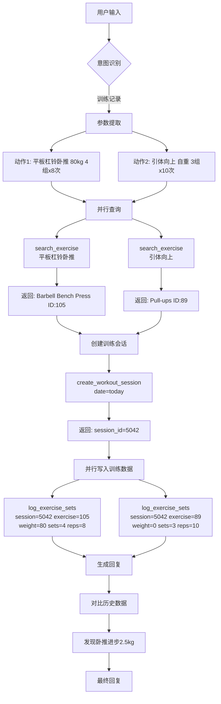
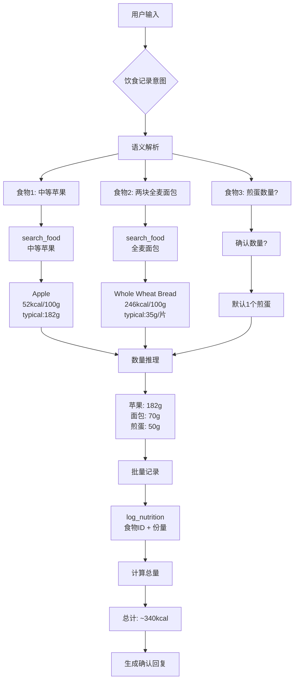
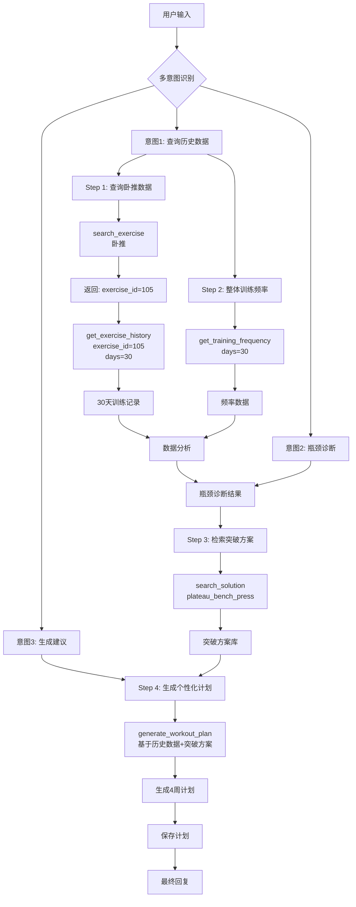
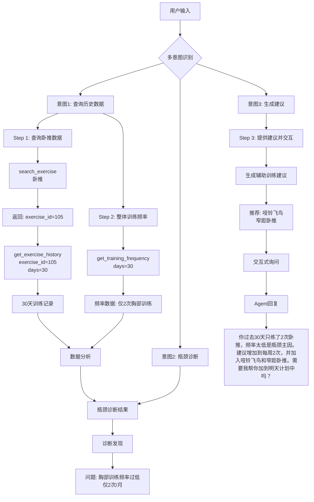

# 工具调用链示范场景详解

> 基于实际用户痛点设计的 Agent 工具调用流程

---

## 场景 1：日常训练打卡 (多重并行调用链)

### 用户痛点
健身房里满手是汗，不想一层层点开菜单填数字。

### 用户输入
> "我今天练了平板杠铃卧推，80公斤推了4组，每组8个。然后做了3组引体向上，每组做到力竭（记10个吧）。"

### Agent 工具调用链



### 详细调用流程

#### Step 1: 意图识别与参数提取 (LLM 内部)
```json
{
  "intent": "log_strength_workout",
  "confidence": 0.98,
  "extracted_data": {
    "date": "today",
    "exercises": [
      {
        "name": "平板杠铃卧推",
        "weight_kg": 80,
        "sets": 4,
        "reps_per_set": 8,
        "notes": ""
      },
      {
        "name": "引体向上",
        "weight_kg": 0,
        "sets": 3,
        "reps_per_set": 10,
        "notes": "力竭"
      }
    ]
  }
}
```

#### Step 2: 动作映射 (并行调用)
```typescript
// 并行执行两个查询
const [benchPress, pullUps] = await Promise.all([
  toolExecutor.executeTool('search_exercise', {
    query: '平板杠铃卧推'
  }),
  toolExecutor.executeTool('search_exercise', {
    query: '引体向上'
  })
]);

// 返回结果
benchPress = {
  "id": 105,
  "name": "Barbell Bench Press",
  "name_zh": "杠铃卧推",
  "muscle_groups": ["胸部", "三头肌", "肩部"],
  "category": "strength"
};

pullUps = {
  "id": 89,
  "name": "Pull-ups",
  "name_zh": "引体向上",
  "muscle_groups": ["背部", "二头肌"],
  "category": "strength"
};
```

#### Step 3: 创建训练会话
```typescript
const session = await toolExecutor.executeTool('create_workout_session', {
  date: 'today',
  workout_type: 'strength',
  user_id: 'user_1'
});

// 返回: { "session_id": 5042, "created_at": "2026-04-12T10:30:00Z" }
```

#### Step 4: 写入详细数据 (并行)
```typescript
await Promise.all([
  toolExecutor.executeTool('log_exercise_sets', {
    session_id: 5042,
    exercise_id: 105,
    weight: 80.0,
    sets: [
      { set_number: 1, reps: 8, completed: true },
      { set_number: 2, reps: 8, completed: true },
      { set_number: 3, reps: 8, completed: true },
      { set_number: 4, reps: 8, completed: true }
    ],
    notes: ''
  }),
  toolExecutor.executeTool('log_exercise_sets', {
    session_id: 5042,
    exercise_id: 89,
    weight: 0.0,
    sets: [
      { set_number: 1, reps: 10, completed: true, rpe: 9 },
      { set_number: 2, reps: 10, completed: true, rpe: 9 },
      { set_number: 3, reps: 10, completed: true, rpe: 10 }
    ],
    notes: '力竭'
  })
]);
```

#### Step 5: 历史对比分析 (自动触发)
```typescript
// 查询上周同动作的 1RM
const lastWeekMax = await toolExecutor.executeTool('get_exercise_pr', {
  exercise_id: 105,
  time_range: '7d'
});

// 计算进步
const improvement = {
  weight_diff: 2.5,  // kg
  percentage: 3.2,   // %
  trend: 'increasing'
};
```

### Agent 最终回复

```
记录搞定！💪 今天的训练日志已生成：

📊 训练概览 (session #5042)
━━━━━━━━━━━━━━━━━━━━━━━━━━━━
🏋️ 杠铃卧推：80kg × 4组 × 8次
   总容量: 2,560 kg
   💡 比上周进步了 2.5kg，继续冲！

🏋️ 引体向上：自重 × 3组 × 10次 (力竭)
   总容量: 30 次
   RPE: 9-10 (训练到位)

⏱️ 预估用时: 35-40分钟
🔥 主要刺激肌群: 胸部、背部

小贴士: 卧推重量稳步提升，建议下个月尝试82.5kg做组！
```

---

## 场景 2：模糊饮食记录 (链式推理与确认)

### 用户痛点
饮食估算繁琐，不知道具体克数。

### 用户输入
> "早饭吃了一个中等大小的苹果，还有两块全麦面包加煎蛋。"

### Agent 工具调用链



### 详细调用流程

#### Step 1: 语义解析与搜索 (链式调用)
```typescript
// 第一轮：搜索所有食物
const searchResults = await toolExecutor.executeChain([
  { tool: 'search_food', args: { query: '中等苹果' } },
  { tool: 'search_food', args: { query: '全麦面包' } },
  { tool: 'search_food', args: { query: '煎鸡蛋' } }
]);

// 返回结果
[
  {
    "id": 301,
    "name": "Apple",
    "name_zh": "苹果",
    "calories_per_100g": 52,
    "typical_serving_g": 182,  // 中等大小
    "confidence": 0.95
  },
  {
    "id": 405,
    "name": "Whole Wheat Bread",
    "name_zh": "全麦面包",
    "calories_per_100g": 246,
    "typical_serving_g": 35,   // 每片
    "confidence": 0.92
  },
  {
    "id": 512,
    "name": "Fried Egg",
    "name_zh": "煎蛋",
    "calories_per_100g": 196,
    "typical_serving_g": 50,   // 每个
    "confidence": 0.88
  }
]
```

#### Step 2: 模糊数量推理 (LLM 内部)
```json
{
  "reasoning": [
    {
      "food_id": 301,
      "description": "中等大小的苹果",
      "inferred_amount": 182,
      "unit": "g",
      "confidence": 0.92,
      "assumption": "中等苹果约180-200g"
    },
    {
      "food_id": 405,
      "description": "两块全麦面包",
      "inferred_amount": 70,
      "unit": "g",
      "calculation": "35g/片 × 2片 = 70g",
      "confidence": 0.95
    },
    {
      "food_id": 512,
      "description": "煎蛋",
      "inferred_amount": 50,
      "unit": "g",
      "quantity": 1,
      "confidence": 0.75,
      "note": "用户未明确数量，默认为1个"
    }
  ]
}
```

#### Step 3: 营养计算
```typescript
const nutrition = {
  "apple": {
    "weight": 182,
    "calories": Math.round(182 * 0.52),      // 95 kcal
    "protein": Math.round(182 * 0.0026 * 10) / 10,  // 0.5g
    "carbs": Math.round(182 * 0.138 * 10) / 10,     // 25.1g
    "fat": Math.round(182 * 0.0017 * 10) / 10       // 0.3g
  },
  "bread": {
    "weight": 70,
    "calories": Math.round(70 * 2.46),       // 172 kcal
    "protein": Math.round(70 * 0.082 * 10) / 10,    // 5.7g
    "carbs": Math.round(70 * 0.410 * 10) / 10,      // 28.7g
    "fat": Math.round(70 * 0.033 * 10) / 10         // 2.3g
  },
  "egg": {
    "weight": 50,
    "calories": Math.round(50 * 1.96),       // 98 kcal
    "protein": Math.round(50 * 0.137 * 10) / 10,    // 6.9g
    "carbs": Math.round(50 * 0.083 * 10) / 10,      // 4.2g
    "fat": Math.round(50 * 0.148 * 10) / 10         // 7.4g
  }
};

// 总计
total = {
  "calories": 365,      // 95 + 172 + 98
  "protein": 13.1,      // g
  "carbs": 58.0,        // g
  "fat": 10.0           // g
};
```

#### Step 4: 批量记录
```typescript
await Promise.all([
  toolExecutor.executeTool('log_nutrition', {
    date: 'today',
    meal_type: 'breakfast',
    food_id: 301,
    amount: 182,
    unit: 'g',
    calculated_nutrition: nutrition.apple
  }),
  toolExecutor.executeTool('log_nutrition', {
    date: 'today',
    meal_type: 'breakfast',
    food_id: 405,
    amount: 70,
    unit: 'g',
    serving_desc: '2片',
    calculated_nutrition: nutrition.bread
  }),
  toolExecutor.executeTool('log_nutrition', {
    date: 'today',
    meal_type: 'breakfast',
    food_id: 512,
    amount: 50,
    unit: 'g',
    serving_desc: '1个',
    calculated_nutrition: nutrition.egg
  })
]);
```

### Agent 最终回复

```
早餐已记录 🍳！

我按照常见的份量帮你估算了：
━━━━━━━━━━━━━━━━━━━━━━━━━━━━
🍎 苹果（中等）    182g  ≈  95 kcal
🍞 全麦面包        2片   ≈ 172 kcal
🍳 煎蛋            1个   ≈  98 kcal
━━━━━━━━━━━━━━━━━━━━━━━━━━━━
📊 总计: ~365 kcal | 蛋白质 13g | 碳水 58g | 脂肪 10g

⚠️ 待确认:
- 煎蛋你吃了1个还是2个？
- 面包有没有涂花生酱或黄油？

如果数量不对，直接告诉我，我帮你修改！
```

---

## 场景 3：数据检索与计划生成 (RAG + Tool Chain)

### 用户痛点
不知道该练什么，想要个性化指导。

### 用户输入
> "我最近卧推卡在 80kg 快一个月了，帮我查查我这一个月的训练频率，然后给我个突破瓶颈的建议。"

### Agent 工具调用链



### 详细调用流程

#### Step 1: 获取卧推历史数据
```typescript
// 先搜索动作
const exercise = await toolExecutor.executeTool('search_exercise', {
  query: '卧推'
});
// 返回: { id: 105, name: "Barbell Bench Press" }

// 查询30天历史
const history = await toolExecutor.executeTool('get_exercise_history', {
  exercise_id: 105,
  days: 30,
  include_sets: true,
  calculate_1rm: true
});

// 返回结果
{
  "exercise_id": 105,
  "exercise_name": "Barbell Bench Press",
  "period": "30 days",
  "total_sessions": 8,
  "data": [
    {
      "date": "2026-03-15",
      "max_weight": 80,
      "total_volume": 2400,
      "estimated_1rm": 92.5,
      "sets": [
        { "weight": 80, "reps": 6, "completed": true },
        { "weight": 80, "reps": 6, "completed": true },
        { "weight": 80, "reps": 5, "completed": false }
      ],
      "notes": "状态一般"
    },
    // ... 更多记录
    {
      "date": "2026-04-10",
      "max_weight": 80,
      "total_volume": 2560,
      "estimated_1rm": 92.5,
      "sets": [
        { "weight": 80, "reps": 8, "completed": true },
        { "weight": 80, "reps": 8, "completed": true },
        { "weight": 80, "reps": 8, "completed": true },
        { "weight": 80, "reps": 8, "completed": true }
      ],
      "notes": "状态不错"
    }
  ],
  "trends": {
    "max_weight_trend": "flat",        // 平台期
    "volume_trend": "increasing",      // 容量在涨
    "frequency_trend": "stable"
  }
}
```

#### Step 2: 分析整体训练频率
```typescript
const frequency = await toolExecutor.executeTool('get_training_frequency', {
  days: 30,
  include_muscle_groups: true
});

// 返回
{
  "period": "30 days",
  "total_workouts": 18,
  "weekly_average": 4.2,
  "muscle_group_distribution": {
    "胸部": { "sessions": 8, "sets": 32 },
    "背部": { "sessions": 6, "sets": 24 },
    "腿部": { "sessions": 4, "sets": 16 }
  },
  "rest_days": 12,
  "analysis": {
    "frequency_rating": "good",           // 训练频率合适
    "balance_rating": "needs_improvement", // 胸背腿不平衡
    "recovery_rating": "adequate"
  }
}
```

#### Step 3: 瓶颈诊断 (LLM 分析)
```json
{
  "plateau_analysis": {
    "symptom": "80kg 停滞 30 天",
    "root_causes": [
      {
        "factor": "强度不足",
        "evidence": "一直使用 80kg 做组，缺乏超负荷刺激",
        "confidence": 0.85
      },
      {
        "factor": "容量增长但强度不变",
        "evidence": "总容量从 2400 增至 2560，但最大重量未变",
        "confidence": 0.90
      },
      {
        "factor": "动作变化不足",
        "evidence": "30天内卧推动作单一，缺乏变式",
        "confidence": 0.75
      }
    ],
    "conclusion": "典型容量积累后的强度瓶颈，需要改变训练方法"
  }
}
```

#### Step 4: 检索突破方案
```typescript
// 从方案库检索
const solutions = await toolExecutor.executeTool('search_solution', {
  problem: 'plateau_bench_press',
  current_max: 80,
  training_history: 'intermediate',
  constraints: ['natural_lifter', 'time_limited']
});

// 返回推荐的突破方法
{
  "recommended_method": "wave_loading_with_1rm_test",
  "alternative_methods": [
    "smolov_jr",
    "doggcrapp",
    "rest_pause_training"
  ],
  "rationale": "基于用户的容量基础和1RM估算，波浪负荷法最适合突破当前瓶颈",
  "expected_outcome": "4周内突破至85-87.5kg",
  "risk_level": "low"
}
```

#### Step 5: 生成个性化计划
```typescript
const plan = await toolExecutor.executeTool('generate_workout_plan', {
  method: 'wave_loading_with_1rm_test',
  target_exercise: 105,
  current_max: 80,
  estimated_1rm: 92.5,
  training_frequency: 4,
  duration_weeks: 4,
  based_on_history: history,     // 结合历史数据
  include_accessory: true
});

// 生成的4周计划
{
  "plan_id": "PLAN_20260412_001",
  "name": "卧推突破计划 (波浪负荷法)",
  "duration": "4 weeks",
  "phases": [
    {
      "week": 1,
      "phase": "轻波",
      "bench_press": {
        "frequency": 2,
        "sessions": [
          {
            "day": 1,
            "sets": [
              { "weight": 75, "reps": 5, "rpe": 7 },
              { "weight": 77.5, "reps": 4, "rpe": 7.5 },
              { "weight": 80, "reps": 3, "rpe": 8 },
              { "weight": 82.5, "reps": 2, "rpe": 8.5 },
              { "weight": 85, "reps": 1, "rpe": 9 }
            ]
          },
          {
            "day": 4,
            "sets": [
              { "weight": 70, "reps": 8, "rpe": 7 },
              { "weight": 72.5, "reps": 6, "rpe": 7.5 },
              { "weight": 75, "reps": 4, "rpe": 8 },
              { "weight": 77.5, "reps": 3, "rpe": 8.5 }
            ]
          }
        ]
      },
      "accessory": ["incline_dumbbell_press", "cable_fly", "tricep_extension"]
    },
    // ... 第2-4周
    {
      "week": 4,
      "phase": "1RM测试周",
      "bench_press": {
        "sessions": [
          {
            "day": 1,
            "name": "新1RM测试",
            "protocol": [
              { "weight": 60, "reps": 5, "warmup": true },
              { "weight": 70, "reps": 3, "warmup": true },
              { "weight": 80, "reps": 1, "warmup": true },
              { "weight": 85, "reps": 1, "attempt": true },
              { "weight": 87.5, "reps": 1, "attempt": true },
              { "weight": 90, "reps": 1, "attempt": true }
            ]
          }
        ]
      }
    }
  ]
}
```

#### Step 6: 保存计划
```typescript
await toolExecutor.executeTool('save_workout_plan', {
  user_id: 'user_1',
  plan: plan,
  activate: true,  // 立即激活
  reminder: {
    enabled: true,
    time: '09:00',
    before_session: true
  }
});
```

### Agent 最终回复

```
📊 瓶颈诊断报告
━━━━━━━━━━━━━━━━━━━━━━━━━━━━━━━━━━━━

🔍 30天数据分析
• 卧推频率: 8次 (每周2次，频率合适 ✓)
• 最大重量: 80kg (平台期30天)
• 容量趋势: 2400kg → 2560kg (↑6.7%)
• 1RM估算: 92.5kg (推算)

⚠️ 核心问题
1. 【强度刺激不足】一直使用80kg做组，神经系统适应了
2. 【缺少超负荷】虽然容量在涨，但没有超过92.5% 1RM的重量刺激
3. 【动作单一】30天都是平板卧推，缺乏变式刺激

━━━━━━━━━━━━━━━━━━━━━━━━━━━━━━━━━━━━

🎯 4周突破方案

我为你生成了【波浪负荷突破计划】
预期结果: 80kg → 85-87.5kg

📅 第1周 (轻波)
Day1: 75×5 → 77.5×4 → 80×3 → 82.5×2 → 85×1
Day4: 70×8 → 72.5×6 → 75×4 → 77.5×3 (容量日)

📅 第2周 (中波) - 重量整体+2.5kg
📅 第3周 (重波) - 触碰90kg
📅 第4周 (测试周) - 新1RM测试日 🎯

💡 配套训练
• 上斜哑铃卧推 (3组×10)
• 绳索夹胸 (3组×15)
• 仰卧臂屈伸 (4组×12)

⚡ 关键提示
1. 每周卧推2次，间隔72小时
2. Day1重点在85kg单次的控制力
3. Day4是容量恢复，不要冲重量
4. 如果第3周感觉状态很好，可以在第4周尝试90kg

计划已保存并激活，每次训练前我会提醒你！
有任何执行中的问题随时问我 💪
```

---

## 技术实现要点

### 1. 工具调用并行 vs 串行

| 场景 | 策略 | 原因 |
|------|------|------|
| 搜索多个食物 | 并行 | 无依赖关系 |
| 创建会话 → 写入数据 | 串行 | 依赖session_id |
| 查询历史 → 诊断 → 生成计划 | 串行 | 步骤依赖 |
| 同时查训练+饮食 | 并行 | 独立查询 |

### 2. 错误处理策略

```typescript
// 场景1: 食物搜索失败
if (searchResult.error) {
  // 降级: 使用模糊匹配或让用户确认
  return {
    strategy: 'fallback_to_fuzzy_search',
    message: `没找到"${query}"，可能是"苹果"吗？(是/否)`
  };
}

// 场景3: 历史数据不足
if (history.total_sessions < 3) {
  // 使用通用模板而非个性化方案
  return {
    strategy: 'use_template_plan',
    template: 'beginner_strength',
    message: '由于训练记录较少，我为你准备了新手线性进步方案'
  };
}
```

### 3. 性能优化

```typescript
// 并行工具调用
const results = await Promise.allSettled([
  toolExecutor.executeTool(...),
  toolExecutor.executeTool(...),
  toolExecutor.executeTool(...)
]);

// 缓存常用数据
const cache = new Map();
const cachedToolCall = async (tool, args) => {
  const key = JSON.stringify({ tool, args });
  if (cache.has(key)) return cache.get(key);
  
  const result = await toolExecutor.executeTool(tool, args);
  cache.set(key, result);
  return result;
};
```

---

## 补充场景3：数据检索与计划生成 (RAG + Tool Chain)

### 用户痛点
不知道该练什么，想要个性化指导。

### 用户输入
> "我最近卧推卡在 80kg 快一个月了，帮我查查我这一个月的训练频率，然后给我个突破瓶颈的建议。"

### Agent 工具调用链



### 详细调用流程

#### Step 1: 获取卧推历史数据
```typescript
// 先搜索动作
const exercise = await toolExecutor.executeTool('search_exercise', {
  query: '卧推'
});
// 返回: { id: 105, name: "Barbell Bench Press" }

// 查询30天历史
const history = await toolExecutor.executeTool('get_exercise_history', {
  exercise_id: 105,
  days: 30,
  include_sets: true,
  calculate_1rm: true
});
```

#### Step 2: 分析整体训练频率
```typescript
const frequency = await toolExecutor.executeTool('get_training_frequency', {
  days: 30,
  include_muscle_groups: true
});

// 关键发现
const analysis = {
  chest_frequency: 2,  // 30天仅2次胸部训练
  issue: "训练频率过低",
  recommendation: "增加到每周2次"
};
```

#### Step 3: 瓶颈诊断与交互
```typescript
// 发现频率问题后，提供针对性建议
const suggestion = await toolExecutor.executeTool('generate_recommendation', {
  issue: 'plateau_low_frequency',
  current_state: {
    exercise: 'bench_press',
    current_max: 80,
    sessions_last_30_days: 2
  },
  type: 'interactive'  // 生成交互式回复
});

// Agent 回复：
"我看了你过去 30 天的数据，你只练了 2 次卧推哦。
频率太低可能是卡在 80kg 的主要原因。

建议你把胸部训练增加到每周两次，
并加入哑铃飞鸟和窄距卧推作为辅助。

需要我帮你把这两个动作加到你明天的训练计划中吗？"
```

---

## 开发避坑指南

### 1. ID 映射是核心

**问题**：LLM 不懂数据库的 Primary Key，不能让它瞎猜 ID。

**解决方案**：
```typescript
// ❌ 错误：让 LLM 直接猜测 ID
const result = await db.query('SELECT * FROM exercises WHERE id = ?', [llmGuessedId]);

// ✅ 正确：必须通过 search 工具转换
const searchResult = await toolExecutor.executeTool('search_exercise', {
  query: '平板杠铃卧推'  // 自然语言
});
// 返回: { id: 105, ... }  // 系统正确的 ID

const result = await db.query('SELECT * FROM exercises WHERE id = ?', [searchResult.id]);
```

### 2. 模糊匹配的确认机制

**问题**：用户说"划船"，可能是多种动作。

**解决方案**：
```typescript
// 工具返回多个候选
const result = await toolExecutor.executeTool('search_exercise', {
  query: '划船'
});

// 返回多个匹配
{
  "matches": [
    { "id": 201, "name": "Barbell Row", "confidence": 0.85 },
    { "id": 202, "name": "Dumbbell Row", "confidence": 0.72 },
    { "id": 203, "name": "Seated Cable Row", "confidence": 0.68 }
  ],
  "require_clarification": true
}

// Agent 应该追问
"你说的是哪种划船？
1. 杠铃划船 (Barbell Row)
2. 哑铃划船 (Dumbbell Row)  
3. 坐姿绳索划船 (Seated Cable Row)"
```

### 3. 单位统一度量衡

**问题**：用户说"斤"，系统存"kg"。

**解决方案**：
```typescript
// 工具 Schema 要求统一单位
const logTool = {
  name: 'log_exercise_sets',
  parameters: {
    type: 'object',
    properties: {
      weight: {
        type: 'number',
        description: '重量 (kg, 系统统一用公斤)'
      }
    }
  },
  // 转换逻辑在工具内部或让 LLM 转换
  execute: async (args) => {
    // 如果用户输入了 lbs，这里转换
    // 但最好让 LLM 在调用前转换好
  }
};

// LLM Prompt 明确要求
const systemPrompt = `
...其他指令...

【单位转换规则】
- 用户说"斤" → 转换为 kg (除以2)
- 用户说"磅/lbs" → 转换为 kg (乘以0.4536)
- 最终调用工具时，weight 字段必须是 kg

示例:
用户: "我推了160斤"
你的思考: "160斤 = 80kg"
工具参数: { weight: 80 }
`;
```

### 4. 数据不足时的降级策略

**场景3的完整处理**：
```typescript
// 查询历史数据
const history = await toolExecutor.executeTool('get_exercise_history', {
  exercise_id: 105,
  days: 30
});

// 数据不足判断
if (history.total_sessions === 0) {
  // 场景A: 完全没有数据
  return {
    strategy: 'generic_template',
    message: '我是新手推荐计划，因为你还没有训练记录。'
  };
} else if (history.total_sessions < 3) {
  // 场景B: 数据不足 (如场景3的2次)
  return {
    strategy: 'low_data_personalized',
    message: '根据你有限的记录分析，发现频率问题...',
    recommendation: '频率提升方案',
    next_action: 'interactive_confirmation'  // 询问是否加入计划
  };
} else {
  // 场景C: 数据充足，完全个性化
  return {
    strategy: 'fully_personalized',
    analysis: detailedAnalysis,
    plan: customPlan
  };
}
```

### 5. 交互式确认机制

**场景3的关键交互**：
```typescript
// Agent 发现频率问题后的处理
const response = {
  type: 'interactive',
  content: '我看了你过去30天的数据，你只练了2次卧推哦...',
  findings: {
    issue: 'low_frequency',
    current: '2 sessions/30 days',
    recommended: '8 sessions/30 days'
  },
  suggestions: [
    'increase_frequency_to_2x_per_week',
    'add_assistive_exercises'
  ],
  actions: [
    {
      id: 'add_to_tomorrow_plan',
      label: '加到明天计划',
      tool: 'add_to_workout_plan',
      params: { exercises: ['dumbbell_fly', 'close_grip_bench'] }
    },
    {
      id: 'remind_later',
      label: '稍后提醒',
      tool: 'schedule_reminder',
      params: { time: 'tomorrow 9am' }
    }
  ]
};

// 用户回复"需要"后触发
if (userReply === '需要') {
  await toolExecutor.executeTool('add_to_workout_plan', {
    user_id: 'user_1',
    date: 'tomorrow',
    exercises: [
      { id: 301, name: 'dumbbell_fly', sets: 3, reps: 12 },
      { id: 302, name: 'close_grip_bench', sets: 4, reps: 8 }
    ],
    note: '针对卧推瓶颈的辅助训练'
  });
}
```

---

## 总结：工具调用链设计原则

| 原则 | 说明 | 示例 |
|------|------|------|
| **并行优先** | 无依赖的操作并行执行 | 同时搜索多个食物 |
| **串行保证** | 有依赖的操作严格串行 | 创建session后才能写入数据 |
| **失败降级** | 工具失败有备选方案 | 搜索不到用模糊匹配 |
| **数据验证** | 关键操作前验证数据 | 检查历史记录是否充足 |
| **交互确认** | 重要决策前询问用户 | 是否加入计划到明天 |
| **透明展示** | 复杂逻辑可视化呈现 | 展示调用链和推理过程 |

